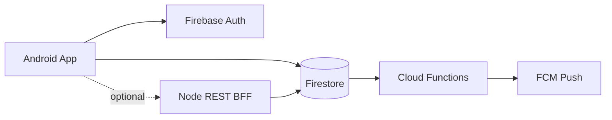

# Developer Networking App

Android app for developer collaboration: project boards, realtime chat, talent search, events, notifications, and admin tooling. Built with **Jetpack Compose**, **MVVM**, and **Firebase** (Auth + Firestore).

## Architecture

- **UI**: `ui/screens` (Route + Screen), `ui/viewmodel`, `ui/state`, `ui/navigation`
- **Data**: `data/repository` + Firestore implementations
- **DI**: `di/AppContainer` + `di/ViewModelFactory` + `appViewModel()` in Compose

See [ui/ARCHITECTURE.md](app/src/main/java/com/example/developernetworkingapp/ui/ARCHITECTURE.md) for layer rules.

### Microservices & REST APIs (course requirement)

| Service | Transport | Purpose |
|---------|-----------|---------|
| Firestore repositories | Firebase SDK | Primary data (tasks, chat, events, inbox, …) |
| Cloud Functions | Event triggers | Inbox, activity, stats, FCM push, RSVP counts |
| **Node analytics API** | `backend/` Express + Retrofit `DevConnectApi` | Dashboard stats + projects aggregates (Firebase Auth JWT) |
| **Hacker News trends** | `TechTrendsApi` → [Algolia HN REST](https://hn.algolia.com/api/v1/) | Search tab live API trends |

Mobile microservices talk to **Firestore**; the **analytics microservice** is the self-hosted Node REST layer reading the same shared Firebase project (works for every teammate).



Production docs: [docs/SECURITY.md](docs/SECURITY.md) · [docs/SLO.md](docs/SLO.md) · [docs/EVENT_BUS.md](docs/EVENT_BUS.md) · [docs/API_CHANGELOG.md](docs/API_CHANGELOG.md)

## Presentation demo flow (5 minutes)

1. **Sign up / log in** — Create an account (email/password or Google).
2. **Verify email** — Open the Firebase verification link in your inbox, return to the app, tap **Verify email** → lands on the dashboard. Login is blocked until verified.
3. **Dashboard** — Review feed, collaborator matches (tap **View** for full profile), and shortcuts to Tasks / Events / Chat.
4. **Projects** — Kanban board; deep-link with `projects?project=DevConnect Mobile` for showcase workspace.
5. **Chat** — Use quick rooms (Project Room, Mentorship, etc.) or inbox threads.
6. **Profile & Settings** — Edit profile; settings persist locally (notifications, privacy toggles).
7. **Admin** (admin role only) — Open from profile; full admin console with user/project/content tools.

## Team setup

**Teammates:** pull → sync Gradle → sign up → verify email → run.  
Details: [docs/TEAM_SETUP_AFTER_PULL.md](docs/TEAM_SETUP_AFTER_PULL.md)

**Backend lead:** deploy rules/indexes/functions + `cd firestore && npm run team:sync-access` so Tasks and Chat work for every Auth user.

### Optional: Node analytics API (local)

```powershell
$env:GOOGLE_APPLICATION_CREDENTIALS="C:\path\to\serviceAccount.json"
$env:FIREBASE_PROJECT_ID="developers-networking-app"
cd backend
npm install
npm start
```

Android emulator uses `http://10.0.2.2:5000/` (`DevConnectApiConfig.kt`). Deploy to Render/Railway for HTTPS and update the base URL once for the whole team.

## Build & run

**Requirements:** Android Studio (latest stable), **JDK 21**, `google-services.json` in `app/` (already in repo).

Copy `local.properties.example` → `local.properties` if Android Studio does not create it automatically.

```bash
./gradlew assembleDebug
./gradlew test
```

Install the debug APK on a device or emulator (API 24+). See [docs/TEAM_SETUP_AFTER_PULL.md](docs/TEAM_SETUP_AFTER_PULL.md) for the full teammate checklist.

## Related docs

| Document | Purpose |
|----------|---------|
| [docs/BACKEND_API.md](../docs/BACKEND_API.md) | Repository methods + Firestore mapping |
| [docs/FIRESTORE_SCHEMA.md](../docs/FIRESTORE_SCHEMA.md) | Collection field reference |
| [docs/DEPLOYMENT.md](../docs/DEPLOYMENT.md) | Rules, indexes, seed deploy |
| [docs/PRESENTATION_SCRIPT.md](../docs/PRESENTATION_SCRIPT.md) | 30-second submission pitch |

## Firebase setup

1. Add your Android app in the Firebase console and place `google-services.json` under `app/`.
2. Enable **Email/Password** authentication.
3. (Optional) Enable **Google** sign-in:
   - In Firebase Console → Authentication → Sign-in method → Google → Enable.
   - Add your debug/release SHA-1 fingerprints for the Android app.
   - Copy the **Web client ID** into `app/src/main/res/values/strings.xml` as `default_web_client_id`, or re-download `google-services.json` after enabling Google.
4. Deploy Firestore rules and seed data (see `firestore/`).
5. Register in the app, verify email, then link demo content to your UID:
   ```powershell
   $env:DEMO_USER_UID="your-firebase-auth-uid"
   cd firestore
   npm run setup:demo-user
   ```

Without seed + `setup:demo-user`, the app still runs but Dashboard, Chat, and Alerts may show empty states for new accounts.

## Authentication

### Email and username login

The login screen accepts **either email or username** with your password:

- Usernames are **case-insensitive** (stored as `usernameLower` in Firestore).
- At signup, the app writes:
  - `users/{firebaseUid}` — profile (`email`, `usernameLower`, `displayName`, …)
  - `usernames/{usernameLower}` — registry `{ userId: uid }` for lookup
- **Password reset** also accepts email or username; usernames resolve to the account email via Firestore.
- **Example:** register as username `jane` with `jane@example.com` → log in with `jane` or `jane@example.com` and your password.

### Google Sign-In

Tap **Google** on the login/signup screen. First-time Google users get an auto-generated username (from their email) and a Firestore profile. Google accounts must have a verified email (Firebase marks them verified automatically).

### Account deletion

Open **Settings → Delete account**. This removes your Firebase Auth user, Firestore profile (`users/{uid}`), username registry entry, and inbox notifications. Shared data in projects, chats, and match requests may remain until cleaned up server-side.

## Key packages

| Package | Purpose |
|---------|---------|
| `ui/navigation/AppNavHost.kt` | Root navigation graph |
| `ui/navigation/MainAppScaffold.kt` | Bottom nav shell |
| `di/ViewModelFactory.kt` | ViewModel construction |
| `data/repository/impl/*` | Firestore-backed repositories |

## License

Academic / portfolio use — see repository owner for terms.
