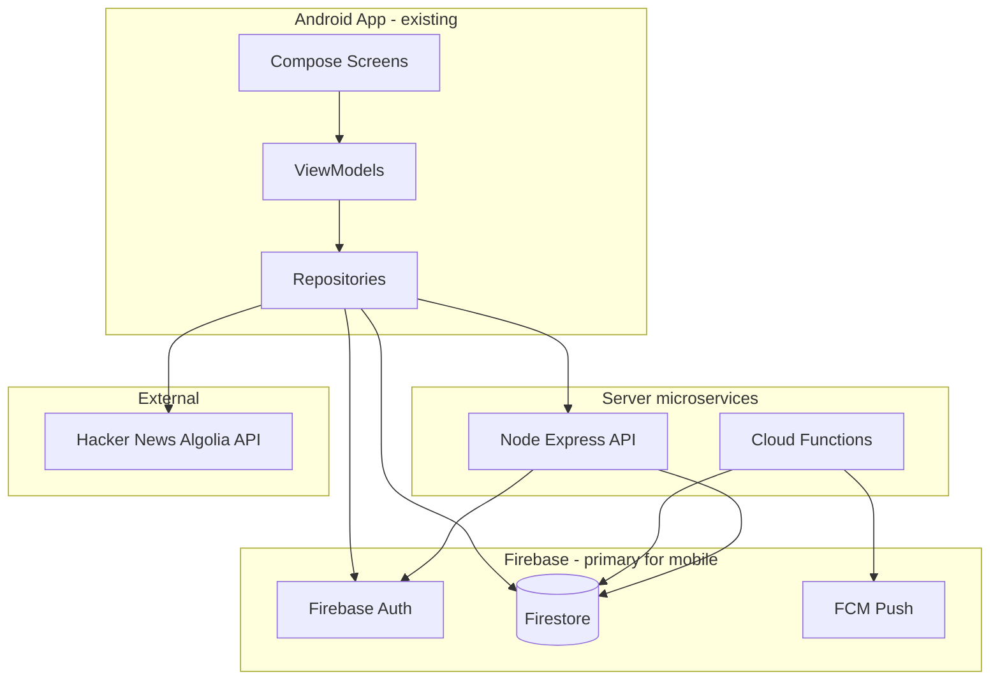

# DevConnect API Design — Backend Specification

**Audience:** Backend developer building REST / server microservices  
**Constraint:** Align with the **existing Android frontend** (no UI changes).  
**Stack:** Firebase Auth + Firestore (source of truth) + Cloud Functions (automation) + Node Express (analytics BFF).

---

## 1. Architecture (how pieces relate)



| Layer | Role | Used by frontend today |
|-------|------|------------------------|
| **Firebase Auth** | Identity (register, login, reset, verify) | `AuthRepositoryFirebase` — **not** custom REST auth |
| **Firestore SDK** | Realtime reads/writes for core features | All `*RepositoryFirestore` classes |
| **Cloud Functions** | Privileged writes (inbox, activity, stats, FCM, RSVP counts) | Triggered server-side; app consumes results in Firestore |
| **Node REST** | Aggregations, admin batch, optional BFF | `DevConnectApi` (dashboard stats overlay) |
| **Algolia HN** | External REST trends | `TechTrendsApi` (Search tab) |

**Design principle:** Mobile talks to Firestore for **interactive, realtime** features. REST is for **aggregations, reporting, admin tooling, and third-party integrations** — not a duplicate CRUD layer for every screen.

---

## 2. Frontend feature → data source map

| Screen / feature | Repository | Operations today | Backend today |
|------------------|------------|----------------|---------------|
| Login / Signup / Reset / Verify | `AuthRepository` | login, signup, reset, verify email | Firebase Auth only |
| Dashboard | `DashboardRepository` | observe feed, stats, suggestions, news, activity | Firestore + optional `GET /api/dashboard/stats` |
| Profile | `ProfileRepository` | observe + update displayName, headline, bio | Firestore `users/{uid}` |
| Projects Kanban | `ProjectsRepository` | observe project + tasks board | Firestore `projects/{id}/tasks` |
| Tasks list | `TasksRepository` | observe, create, move, update, delete tasks | Firestore |
| Search | `SearchRepository` | observe **public projects** (client filter) | Firestore `projects` |
| Live API trends | `TechTrendsRepository` | load HN stories | External Algolia REST |
| Match invites | `MatchRepository` | send, accept, decline, observe pending | Firestore `matchRequests` |
| Chat | `ChatRepository` | observe inbox, thread, send message | Firestore `conversations`, `messages` |
| Alerts / Notifications | `NotificationsRepository` | observe inbox, mark read | Firestore `inbox` (create = Functions/admin only) |
| Events | `EventsRepository` | observe events, register/unregister RSVP | Firestore `events/{id}/registrations/{uid}` |
| Admin console | `AdminRepository` | moderation, broadcast, queues | Firestore + Admin SDK |
| Dashboard feed posts / comments / likes | `DashboardViewModel` | **local UI state only** | **Not persisted — no API** |

---

## 3. Audit of your proposed APIs

| Proposed API | Verdict | Maps to in DevConnect |
|--------------|---------|------------------------|
| **1. Auth** POST register/login/logout/reset | **Do not duplicate in REST** | Firebase Auth SDK already used. Backend verifies **Firebase ID token** only. |
| **2. User Profile** CRUD `/users/{id}` | **Partial** | App reads/writes `users/{uid}` via Firestore. REST optional for admin/web; **GET/PATCH self** if you add a BFF. |
| **3. Developer Search** `/developers/search` | **Not needed** | Search screen queries **projects**, not developer directory. |
| **4. Connection Management** | **Remap** | Use **match requests**: `matchRequests` collection, not generic connections. |
| **5. Post Management** `/posts` | **Not needed** | Dashboard “project feed” is **in-memory** in ViewModel — no Firestore posts. |
| **6. Comment API** | **Not needed** | Comments are local demo state on feed cards. |
| **7. Messaging API** REST chat | **Not for mobile path** | Chat uses Firestore listeners. REST only for bots/integrations if added later. |
| **8. Portfolio / Projects** | **Remap** | “Projects” = **collaboration workspaces** (`projects` + `tasks` + `members`), not user portfolio sites. |
| **9. Notification API** POST create | **Split** | **GET/PATCH read** via Firestore (app). **POST create** = Cloud Functions / admin only. |

---

## 4. Firestore data model (logical relationships)

```
users/{uid}
  ├── fcmTokens[]                    (device push targets)
  └── profile fields

userStats/{uid}                      (server-written counters)

usernames/{usernameLower}            → userId registry

projects/{projectId}
  ├── members/{uid}
  └── tasks/{taskId}

conversations/{conversationId}
  └── messages/{messageId}

matchRequests/{requestId}            fromUserId → toUserId

events/{eventId}
  └── registrations/{userId}

inbox/{notificationId}               recipientUserId
activity/{activityId}                audienceUserId
collaboratorSuggestions/{docId}      viewerUserId → suggestedUserId
newsHighlights/{docId}               curated content
```

**Relationship summary**

- **User** owns projects, sends/receives match requests, registers for events, receives inbox/activity.
- **Project** has members and tasks; visibility controls Search.
- **Match request** accepted → optional direct **conversation** created (app/Functions).
- **Event registration** → Cloud Function updates `events.participantCount`.
- **Task/message changes** → Cloud Functions write **inbox** + **activity** + FCM.

---

## 5. APIs you should build (minimal, professional set)

### 5.1 Authentication (no custom login REST)

**Standard for all Node routes:**

```http
Authorization: Bearer <Firebase_ID_TOKEN>
```

| Endpoint | Method | Purpose |
|----------|--------|---------|
| — | — | Register/login/logout/reset stay on **Firebase Auth** (mobile SDK). |
| `/api/me` | `GET` | Return decoded token claims + Firestore profile snapshot (BFF convenience). |

**Example `GET /api/me`**

```json
{
  "uid": "K2Otw4cIRpfzGrjFHPW62jmkEmC3",
  "email": "dev@example.com",
  "emailVerified": true,
  "profile": {
    "displayName": "Alex Dev",
    "usernameLower": "alexdev",
    "headline": "Mobile + Cloud Engineer",
    "skillTags": ["Android", "Kotlin", "Firebase"]
  }
}
```

**Already implemented:** `backend/middleware/firebaseAuth.js`

---

### 5.2 Dashboard analytics (supports Dashboard screen)

| Endpoint | Method | Frontend use |
|----------|--------|--------------|
| `/api/dashboard/stats` | `GET` | Hero stats cards + greeting overlay |

**Response** (aligned with `DashboardStatsResponseDto`):

```json
{
  "welcomeMessage": "Good evening, Alex Dev",
  "stats": {
    "activeProjectsCount": 4,
    "openTasksCount": 11,
    "unreadMessagesCount": 3,
    "pendingMatchRequestsCount": 2,
    "collaborationsCount": 9,
    "ratingAggregate": 4.8
  },
  "source": "firestore",
  "projectId": "developers-networking-app"
}
```

**Data source:** Read `userStats/{uid}` + `users/{uid}` (same data Firestore repo uses).

**Already implemented:** `backend/routes/dashboardRoutes.js`

---

### 5.3 Projects catalog (supports Search + Dashboard project highlights)

| Endpoint | Method | Frontend use |
|----------|--------|--------------|
| `/api/projects` | `GET` | Public recruiting projects list |
| `/api/projects/{projectId}` | `GET` | Project detail (optional enrichment) |
| `/api/projects/{projectId}/tasks` | `GET` | Task board snapshot (optional; app uses Firestore realtime today) |

**Query params for `GET /api/projects`:**

| Param | Example | Notes |
|-------|---------|-------|
| `visibility` | `public` | Default |
| `lifecycleStatus` | `recruiting` | Matches seed + Search |
| `stack` | `Kotlin` | Server-side filter on `stackTags` / `primaryStackLabel` |
| `limit` | `12` | Pagination |

**Not needed:** `POST/PUT/DELETE /projects` on REST for mobile — Kanban writes go through Firestore rules + member role checks. Add REST project admin routes only under **`/api/admin/projects`** if you build a web admin panel.

**Partially implemented:** `GET /api/projects`

---

### 5.4 Match requests (= Connection Management in this app)

Frontend domain: **collaborator match invites**, not LinkedIn-style connections.

| Firestore (mobile primary) | REST equivalent (optional BFF) |
|--------------------------|--------------------------------|
| `matchRequests` collection | `/api/match-requests` |

| Endpoint | Method | Maps to |
|----------|--------|---------|
| `/api/match-requests/incoming` | `GET` | `observeIncomingRequests()` |
| `/api/match-requests/outgoing` | `GET` | `observeOutgoingRequests()` |
| `/api/match-requests` | `POST` | `{ "toUserId", "message?" }` → send |
| `/api/match-requests/{id}/accept` | `POST` | accept + trigger conversation |
| `/api/match-requests/{id}/decline` | `POST` | decline |

**Recommendation:** Keep mobile on Firestore (realtime). Implement REST only if you need a **web client** or **integration tests** without the SDK.

**Do not build:** `/connections/request` generic API — name and schema don’t match the app.

---

### 5.5 Messaging (Chat screen)

Mobile uses **Firestore listeners** — do **not** replace with polling REST for the app.

| Need | Where |
|------|--------|
| Send message | Firestore `conversations/{id}/messages` |
| Inbox list | Firestore query `participantIds` array-contains |
| Mark read | Firestore update `readByUserIds` |
| Push to recipients | Cloud Function `onMessageCreated` → inbox + FCM |

**Optional REST (integrations only):**

| Endpoint | Method | Use case |
|----------|--------|----------|
| `/api/conversations` | `GET` | Web chat client |
| `/api/conversations/{id}/messages` | `GET` | History export |
| `/api/conversations/{id}/messages` | `POST` | Bot / Slack bridge |

---

### 5.6 Notifications / Inbox (Alerts tab)

| Operation | Who writes | Who reads |
|-----------|------------|-----------|
| Create notification | Cloud Functions, Admin SDK | — |
| List + mark read | — | Mobile Firestore |

| Endpoint | Method | Notes |
|----------|--------|-------|
| `/api/inbox` | `GET` | Optional BFF; app uses Firestore directly |
| `/api/inbox/{id}/read` | `PATCH` | `{ "read": true }` |
| `/api/inbox` | `POST` | **Admin only** — broadcast |

**Do not expose** public `POST /notifications` — spam risk. Creation stays server-side (already in Functions).

**FCM transport:** `onInboxCreated` → push to `users/{uid}.fcmTokens[]`

---

### 5.7 Events + RSVP (Events screen)

| Firestore (mobile) | REST optional |
|--------------------|---------------|
| `events` read | `GET /api/events` |
| `events/{id}/registrations/{uid}` write | `POST/DELETE /api/events/{id}/registrations/me` |

| Endpoint | Method | Body |
|----------|--------|------|
| `/api/events` | `GET` | List curated events |
| `/api/events/{eventId}` | `GET` | Event detail |
| `/api/events/{eventId}/registrations/me` | `POST` | `{ "status": "going" \| "waitlist" }` |
| `/api/events/{eventId}/registrations/me` | `DELETE` | Unregister |

**Server side:** Cloud Functions adjust `participantCount` on registration create/delete.

---

### 5.8 Tasks (Tasks + Projects screens)

| Operation | Mobile today | REST |
|-----------|--------------|------|
| List/move/create/delete tasks | Firestore subcollection | Optional `GET/PATCH /api/projects/{id}/tasks` |

Firestore path: `projects/{projectId}/tasks/{taskId}`

REST useful for:
- CI/CD task import
- Admin reporting (`GET /api/admin/tasks?assignee={uid}`)

---

### 5.9 Profile (Profile screen)

| Endpoint | Method | Notes |
|----------|--------|-------|
| `/api/users/me` | `GET` | Same as `/api/me` profile block |
| `/api/users/me` | `PATCH` | `{ displayName, headline, bio }` — mirror Firestore merge |

**Do not implement** `DELETE /users/{id}` on public API — use admin ban/deactivate (`accountRole: banned`) via admin routes.

---

### 5.10 Admin API (Admin console — role-gated)

Prefix: `/api/admin/*` — require `users/{uid}.accountRole == admin`.

| Endpoint | Method | Purpose |
|----------|--------|---------|
| `/api/admin/users` | `GET` | User catalog |
| `/api/admin/users/{id}` | `PATCH` | Role, ban, skillTags, bio |
| `/api/admin/projects/{id}` | `PATCH` | Moderate project |
| `/api/admin/match-requests/pending` | `GET` | Content queue |
| `/api/admin/inbox/broadcast` | `POST` | `{ title, body, audience }` |
| `/api/admin/analytics/export` | `GET` | CSV export |

---

### 5.11 External REST (already satisfies course requirement)

| API | Base URL | Frontend |
|-----|----------|----------|
| Hacker News Algolia | `https://hn.algolia.com/api/v1/` | Search → Live API Trends |

**No DevConnect backend work required** for this path.

---

## 6. Cloud Functions (not REST — but part of your backend)

These are **server microservices** the frontend depends on:

| Trigger | Writes |
|---------|--------|
| Auth `onUserCreate` | `userStats`, welcome `inbox`, `collaboratorSuggestions`, project/chat access |
| `onTaskUpdated` | inbox (`task_update`), `activity`, `userStats.openTasksCount` |
| `onMessageCreated` | inbox (`message`), conversation preview |
| `onInboxCreated` | FCM push |
| `onEventRegistrationCreated/Deleted` | `events.participantCount` |

Mobile **reads the results** from Firestore — no REST polling needed.

---

## 7. Recommended Node API surface (implement order)

**Implemented in `backend/`** — see `backend/README.md` for full list.

| Status | Endpoint |
|--------|----------|
| ✅ | `GET /api/me`, `PATCH /api/me` |
| ✅ | `GET /api/dashboard/stats` |
| ✅ | `GET /api/projects`, `GET /api/projects/:id`, `GET /api/projects/:id/tasks` |
| ✅ | `GET /api/events`, RSVP POST/DELETE |
| ✅ | `GET /api/inbox`, `PATCH /api/inbox/:id/read` |
| ✅ | `GET/POST /api/match-requests/*` |
| ✅ | `GET/POST /api/conversations/*` |
| ✅ | `POST /api/admin/inbox/broadcast` |

**Do not implement (no frontend consumer):**

- REST Auth register/login/logout  
- `/developers/search`  
- `/posts`, `/comments`  
- Generic `/connections/*`  

---

## 8. Professional standards (production checklist)

| Topic | Standard |
|-------|----------|
| **Auth** | Firebase ID token in `Authorization: Bearer` |
| **Errors** | `{ "error": "code", "message": "human readable" }` + HTTP status |
| **Versioning** | Prefix `/api/v1/` when you stabilize (current code uses `/api/`) |
| **Pagination** | `?limit=&cursor=` on list endpoints |
| **Idempotency** | RSVP doc id = `userId`; match request accept is idempotent |
| **Timestamps** | ISO-8601 in JSON; Firestore `Timestamp` server-side |
| **Team config** | One Firebase project; service account in vault; `FIREBASE_PROJECT_ID` env |
| **CORS** | Enabled for web admin; mobile emulator uses `10.0.2.2:5000` |

---

## 9. Summary for presentation

> **“The Android app uses Firebase as the realtime data plane. Cloud Functions enforce server rules for inbox, analytics counters, and push notifications. The Node REST layer is an analytics and admin BFF reading the same Firestore — not a duplicate of every screen. External HN REST covers the live trends requirement.”**

This matches what your teammate built **without changing the frontend**.

---

## 10. File references in repo

| Component | Path |
|-----------|------|
| Repository contracts | `app/.../data/repository/*.kt` |
| Firestore schema | `app/.../schema/FirestoreSchema.kt` |
| Security rules | `firestore.rules` |
| Cloud Functions | `functions/src/index.ts` |
| Node API (started) | `backend/index.js`, `backend/routes/*` |
| Retrofit client | `app/.../remote/DevConnectApi.kt` |
| Team setup | `docs/TEAM_SETUP_AFTER_PULL.md` |
