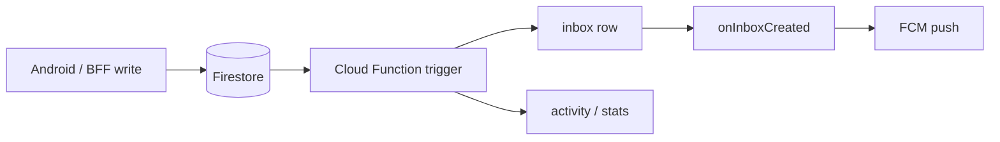

# Event bus — internal automation

DevConnect uses **Firestore writes as events**. No separate message broker in v1.

## Pipelines

| Trigger | Function | Side effects |
|---------|----------|--------------|
| Auth signup | `onUserCreate` | `userStats`, welcome inbox, suggestions, team access |
| Task column change | `onTaskUpdated` | inbox, activity, `openTasksCount` |
| Chat message | `onMessageCreated` | inbox, conversation preview |
| RSVP create/delete | `onEventRegistration*` | `participantCount` |
| Inbox row create | `onInboxCreated` | FCM multicast |

## Idempotency

- Triggers should tolerate duplicate deliveries (Firestore at-least-once semantics)
- Count fields use `FieldValue.increment`
- Match accept uses BFF transaction before conversation create

## Future

- Dead-letter collection for failed function retries (see `docs/BACKEND_ROADMAP.md`)
- Optional Pub/Sub fan-out if traffic grows beyond Firestore triggers
